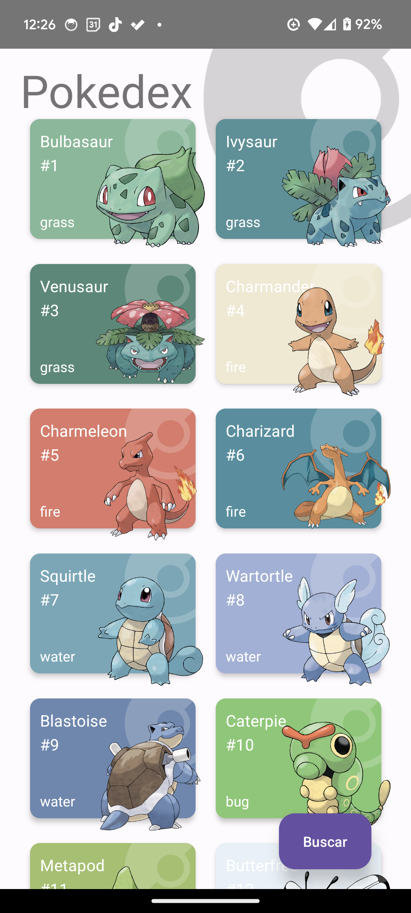
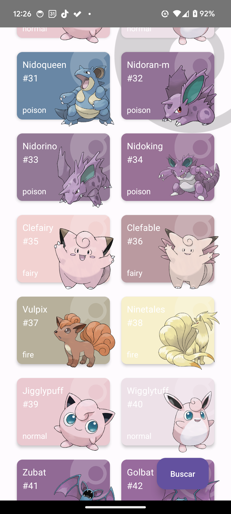
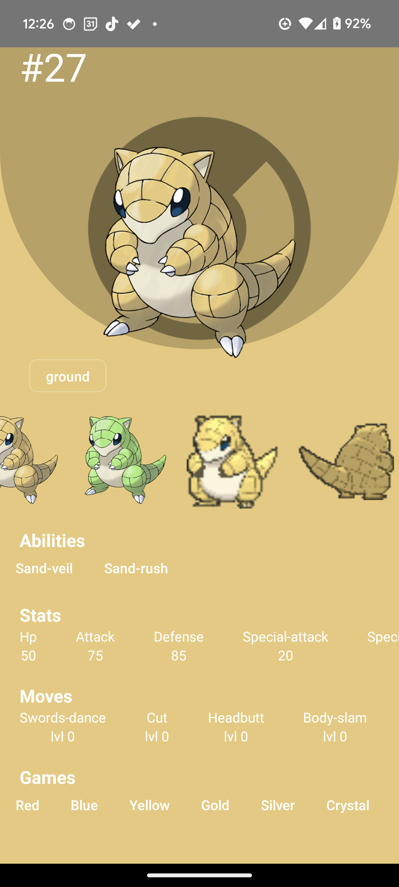
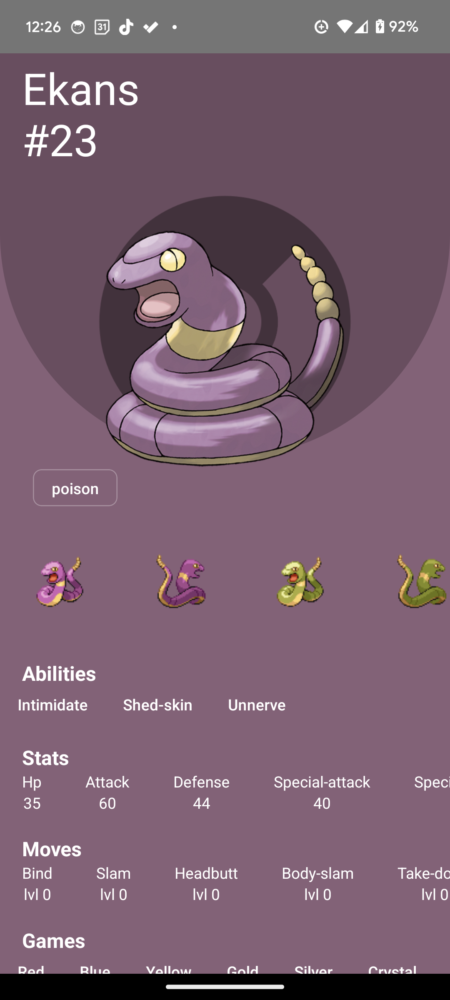
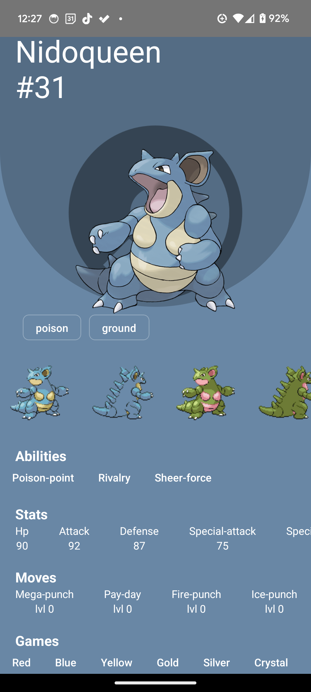
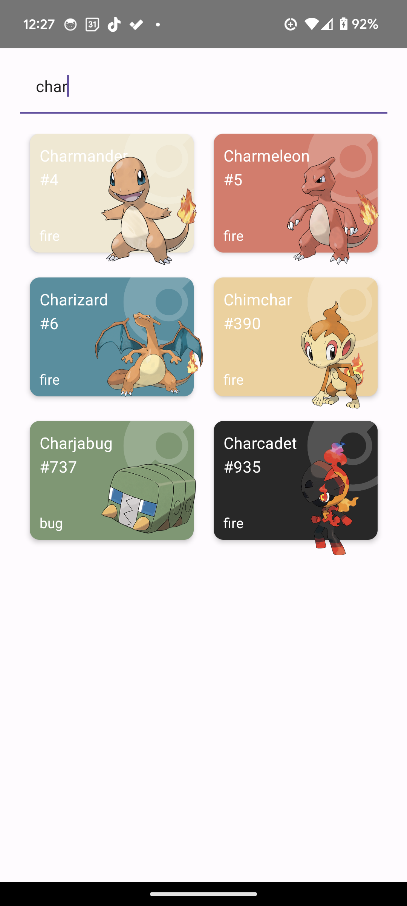
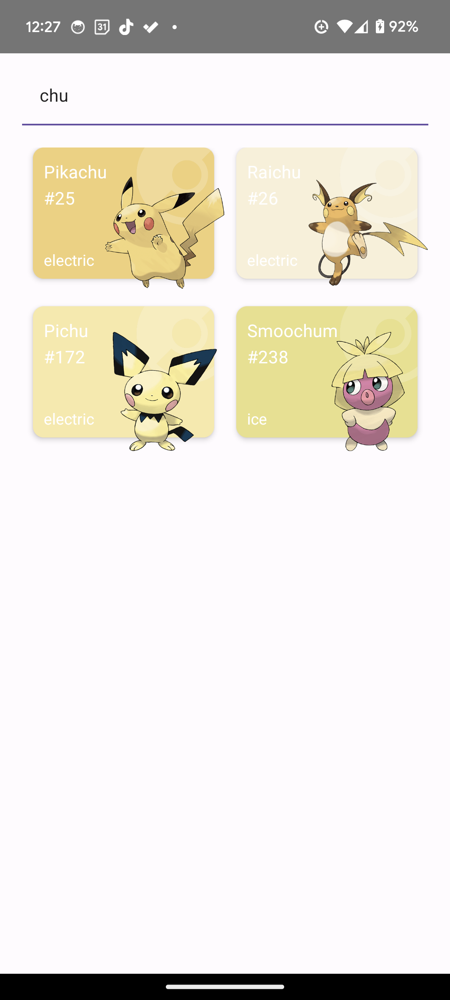
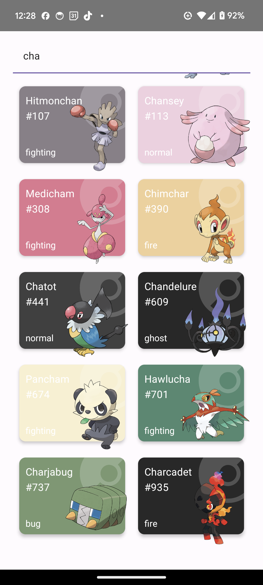

# Pokedex App

### indice 

- [Descripción](#descripción)
- [Tecnologías](#tecnologías)
- [Pantalla de inicio](#pantalla-de-inicio)
- [Detalles de un Pokemon](#detalles-de-un-pokemon)
- [Buscar Pokemon](#buscar-pokemon)

## Descripción

Exta es una aplicación para android desarrollada con react native que permite visualizar la información de diferentes pokemones utilizando la API de [PokeApi](https://pokeapi.co/). Podemos visualizar la lista completa de pokemones en la pantalla de inicio, revisar detalles de cada uno de ellos y buscar pokemones por nombre o id.

## Tecnologías

<table>
   <thead>
      <tr>
         <th>Tecnologías</th>
         <th></th>
      </tr>
   </thead>
   <tbody>
      <tr>
         <td><a href="https://reactnative.dev/">React Native</a></td>
         <td></td>
      </tr>
      <tr>
         <td><a href="https://reactnavigation.org/">React Navigation</a></td>
         <td></td>
      </tr>
      <tr>
         <td><a href="https://reactnativepaper.com/">React Native Paper</a></td>
         <td></td>
      </tr>
      <tr>
         <td><a href="https://axios-http.com/">Axios</a></td>
         <td></td>
      </tr>
      <tr>
         <td><a href="https://tanstack.com/query/latest">TanStack Query</a></td>
         <td></td>
      </tr>
      <tr>
         <td><a href="https://www.typescriptlang.org/">TypeScript</a></td>
         <td></td>
      </tr>
   </tbody>
</table>

## Pantalla de inicio

En la pantalla de inicio se muestra una lista de pokemones con su nombre, id, tipo y su avatar. Los Pokemones están ordenados por id de forma ascendente, según la generación en la que fueron introducidos. Se utiliza una `flatlist` para mostrar los pokemones y una tarjeta de [react native paper](https://reactnativepaper.com/)  como `render item`. Cada tarjeta se colorea según los pixeles del avatar utilizando la librería [react native image colors](https://www.npmjs.com/package/react-native-image-colors).

 
   
   
   

## Detalles de un Pokemon

Al hacer click en una tarjeta de pokemon se abre una pantalla con los detalles del pokemon seleccionado. En esta pantalla se muestra el avatar del pokemon, su nombre, id, tipo, habilidades, stats, movimientos y los juegos en los que ha aparecido. Además se muestra una colección de sprites del pokemon. También se adapta el color de la pantalla según los pixeles del avatar del pokemon.

 
   
   
   

## Buscar Pokemon

Esta pantalla muestra las tarjetas en el mismo estilo que la pantalla de inicio, pero solo muestra los pokemones que coinciden con el texto ingresado en el campo de búsqueda según su nombre o id. Se utiliza un `TextInput` para ingresar el texto de búsqueda y un `flatlist` para mostrar los pokemones. Además se manejan debounces para evitar realizar peticiones a la API en cada cambio de texto.

 
   
   
   

